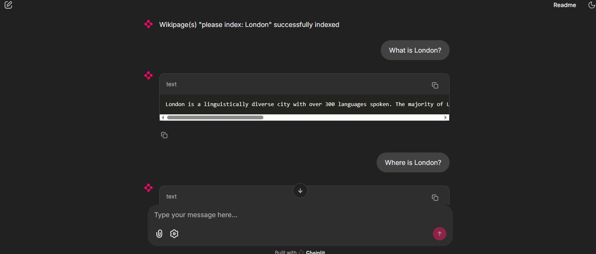

## Basic Architecture of Chat Agent using RAG

## How to start our chat agent
> $ chainlit run chat_agent.py -h

## How to use

1. Click on **Settings** button and set up wikipedia pages to index.
You must follow "please index:" style to indicate wikipedia pages as following.

2. After setting configrations, you will get confirmation result of wikipedia indexing.

3. Now, you can enjoy prompt - our chat agent.

